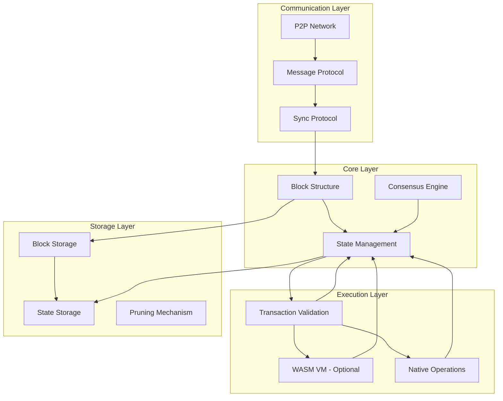

# Blocana: Lightweight Blockchain for Resource-Constrained Environments

Blocana is a minimal, high-performance blockchain platform written in Rust, specifically optimized for lightweight clients such as IoT devices and mobile applications. It focuses on efficiency, speed, and simplicity while maintaining essential blockchain security properties.

## Core Design Principles

- **Lightweight**: Minimized resource requirements (memory, storage, bandwidth)
- **High Performance**: 1000+ TPS on modest hardware
- **Low Latency**: Block finality in under 500ms
- **Security**: Robust validation with minimal computation
- **Simplicity**: Clean architecture with minimal dependencies

## Architecture



## Technical Specifications

### Consensus Mechanism: Lightweight PoET (Proof of Elapsed Time)

Blocana uses a modified Proof of Elapsed Time consensus that requires minimal resources:

- **Energy Efficient**: No heavy computational puzzles
- **Fair Distribution**: Random block production based on waiting times
- **Configurable**: Adjustable block times based on network conditions
- **Finality**: Quick finality through optimized validation

**Trade-off**: We sacrifice some decentralization compared to PoW in favor of efficiency and speed.

### Network Layer: Optimized libp2p

- **Protocol**: Custom libp2p implementation optimized for Rust
- **Discovery**: Lightweight DHT mechanism with geographic optimization
- **Messaging**: Compact binary protocol with delta compression
- **Prioritization**: Transaction and block propagation optimized for latency

**Trade-off**: We optimize for smaller payloads over compatibility with existing networks.

### Storage Layer: Compressed Merkle Trie + SledDB

- **Block Storage**: Compact binary format with efficient encoding
- **State Management**: Modified sparse Merkle trie with aggressive pruning
- **Database**: SledDB for embedded storage with ACID properties
- **Bloom Filters**: For quick transaction lookups and validation

**Trade-off**: By using SledDB, we prioritize speed and compactness over flexibility provided by larger database systems.

### Block Structure

- **Target Size**: <1KB per block
- **Header**: Minimized to essential fields only
- **Transactions**: Compact binary encoding
- **Merkle Root**: For efficient verification

### Smart Contract Layer (Optional)

- **Runtime**: Lightweight WASM virtual machine
- **Language Support**: Rust, AssemblyScript
- **Gas Model**: Simplified for predictable execution
- **Standard Library**: Minimal set of operations

**Trade-off**: Limited functionality compared to Ethereum-like VMs but significantly better performance.

## Performance Metrics

- **Throughput**: >1,000 TPS on modest hardware (Raspberry Pi 4+)
- **Latency**: <500ms block times
- **Storage**: Efficient scaling with history pruning
- **Network**: <100KB/s bandwidth requirement for full nodes
- **Client Resources**: <50MB memory footprint for light clients

## Example Code: Core Components

### Block Structure

```rust
pub struct Block {
    // Compact header with minimal fields
    pub header: BlockHeader,
    // Efficient binary encoding of transactions
    pub transactions: Vec<Transaction>,
    // Authentication path for light client verification
    pub auth_path: MerklePath,
}

pub struct BlockHeader {
    pub version: u8,
    pub previous_hash: [u8; 32],
    pub timestamp: u64,
    pub merkle_root: [u8; 32],
    pub validator: [u8; 32],
    pub signature: [u8; 64],
}
```

### Consensus Engine

```rust
pub struct PoETConsensus {
    // Randomized waiting time based on secure TEE
    wait_time_provider: Box<dyn WaitTimeProvider>,
    // Quick block validation logic
    validator: BlockValidator,
    // Current network parameters
    params: ConsensusParams,
}

impl Consensus for PoETConsensus {
    fn generate_block(&self, txs: Vec<Transaction>) -> Result<Block> {
        // Wait random time based on fair distribution
        self.wait_time_provider.wait()?;
        
        // Create compact block with minimal overhead
        let block = self.create_block(txs)?;
        
        // Sign with validator credentials
        self.sign_block(block)
    }
    
    fn validate_block(&self, block: &Block) -> Result<()> {
        // Fast verification of critical properties
        self.validator.validate(block)
    }
}
```

## Getting Started

### Prerequisites
- Rust 1.70+
- Cargo
- (Optional) WASM toolchain for smart contracts

### Building
```bash
git clone https://github.com/encrypia/blocana.git
cd blocana
cargo build --release
```

### Running a Node
```bash
./target/release/blocana --node --port 8080
```

### Running a Light Client
```bash
./target/release/blocana --light --connect 192.168.1.100:8080
```

## Roadmap

- **Q3 2023**: Core protocol and networking
- **Q4 2023**: Storage optimization and pruning
- **Q1 2024**: WASM smart contract integration
- **Q2 2024**: Mobile and IoT SDK
- **Q3 2024**: Production readiness and security audits

## Contributing

We welcome contributions! See [CONTRIBUTING.md](CONTRIBUTING.md) for guidelines.

## License

MIT
