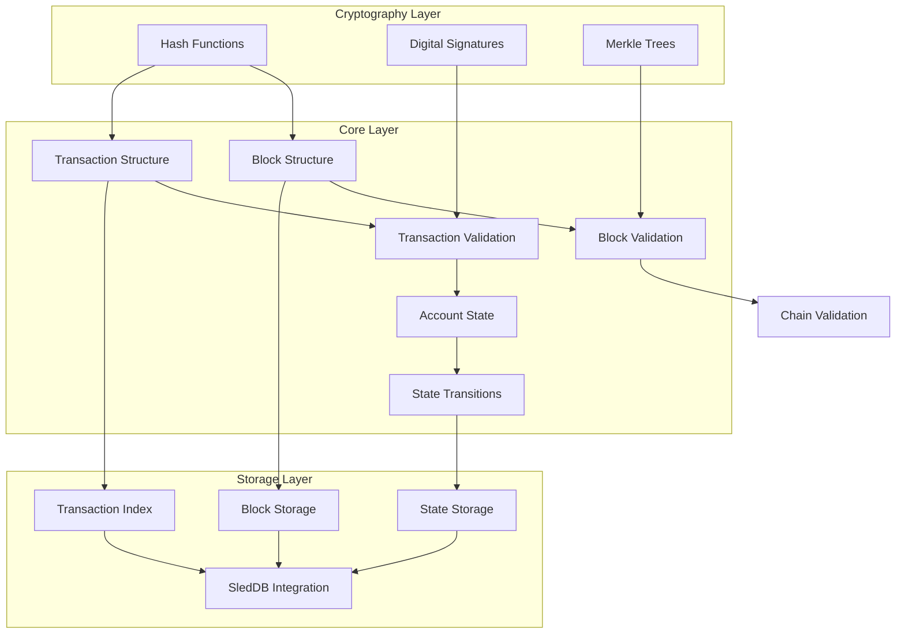
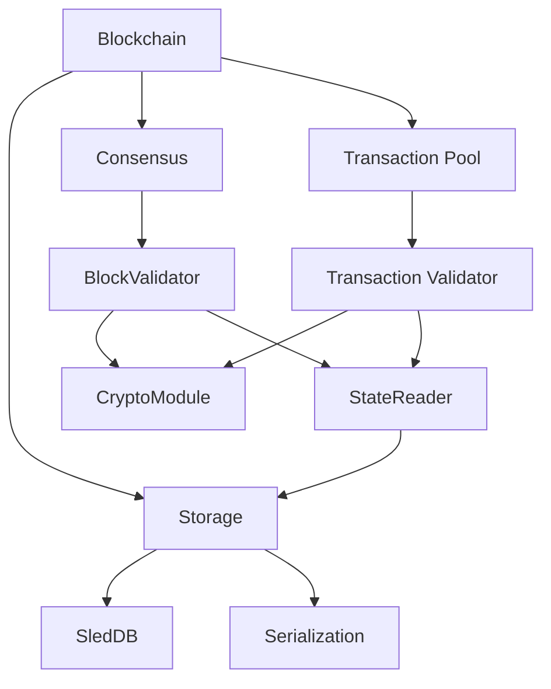

# Stage 1 Architecture: Core Components Design

This document outlines the architectural design decisions for Stage 1 of Blocana, explaining how the core components interact and the reasoning behind key design choices.

## System Overview

Stage 1 establishes the foundational architecture of Blocana, implementing the essential blockchain elements that all subsequent stages will build upon. The architecture follows a modular, layered design that prioritizes clear separation of concerns, maintainability, and efficient resource usage.

## Architectural Principles

The following principles guide the architectural decisions in Stage 1:

1. **Modularity**: Components are designed as self-contained modules with clear interfaces
2. **Separation of Concerns**: Each component has a single, well-defined responsibility
3. **Resource Efficiency**: All components are optimized for minimal resource consumption
4. **Testability**: Architecture enables comprehensive testing of each component in isolation
5. **Extensibility**: Design allows for future enhancements without major restructuring

## Component Architecture

### Block and Transaction Components

The Block and Transaction components form the core data structures of the blockchain:

- **Block Module**: Responsible for block structure, creation, and validation
- **Transaction Module**: Handles transaction representation and verification
- **Merkle Tree**: Provides efficient verification of transaction inclusion

#### Key Interactions:
- Blocks contain transactions and depend on the transaction module for validation
- Block validation uses cryptographic functions to verify signatures and hashes
- Merkle trees provide an efficient mechanism to verify transaction inclusion

### Cryptographic Foundation

The cryptography components provide security primitives to other modules:

- **Hashing Module**: Provides consistent cryptographic hash functions
- **Signature Module**: Implements digital signature creation and verification
- **Key Management**: Handles generation and storage of cryptographic keys

#### Design Decisions:
- **Algorithm Selection**: Ed25519 was chosen for signatures due to its speed and security characteristics
- **Library Usage**: Leveraging established cryptographic libraries rather than custom implementations
- **Abstraction Layer**: Cryptographic operations are abstracted behind interfaces for potential future algorithm changes

### Storage Architecture

The storage components provide persistent blockchain state:

- **Block Store**: Manages block persistence and retrieval
- **State Store**: Maintains the current state of all accounts
- **Transaction Index**: Enables efficient transaction lookups

#### Storage Design Decisions:
- **Embedded Database**: SledDB provides a lightweight yet robust storage solution
- **Tree Structure**: Multiple specialized trees improve query performance
- **Batch Processing**: Critical operations use atomic batches for data integrity
- **Minimal Indexes**: Only essential indexes are maintained to reduce overhead

### State Management

State components track the evolving blockchain state:

- **Account State**: Tracks balances and nonces for all accounts
- **State Transitions**: Applies valid transactions to update state
- **State Verification**: Ensures state consistency and prevents double-spending

#### State Architecture Decisions:
- **Account Model**: Using an account-based (rather than UTXO) model for simplicity and efficiency
- **State Trie**: Efficient storage and verification of the global state
- **Verification Efficiency**: Optimized paths for common state verification operations

## Cross-cutting Concerns

### Error Handling Architecture

Error handling follows a consistent pattern throughout all components:

- **Error Types**: Well-defined error enums with specific variants
- **Error Context**: Errors include contextual information for debugging
- **Propagation Strategy**: Consistent use of the Result type and ? operator
- **Recovery Mechanisms**: Critical components include error recovery paths

### Performance Considerations

Performance optimizations are built into the architecture:

- **Memory Efficiency**: Data structures designed to minimize memory footprint
- **CPU Optimization**: Critical paths optimized for processing efficiency
- **I/O Patterns**: Storage operations designed to minimize disk access
- **Concurrency**: Thread-safe design for potential parallel processing

## Dependencies and Interactions

The following diagram illustrates the key dependencies between components:

## Real-world Analogy

The Stage 1 architecture can be compared to building the foundation and structural framework of a house:

- The **cryptographic components** are like the security systems (locks, alarms) that keep the house secure
- The **block and transaction structures** are like the blueprints and building codes that define how everything fits together
- The **storage layer** is like the foundation that everything rests upon
- The **state management** is like the utility systems (electrical, plumbing) that make the house functional
- The **validation systems** are like building inspectors ensuring everything meets code requirements

## Evolution Path

The Stage 1 architecture is designed to evolve in subsequent stages:

1. **Networking Layer** (Stage 2): Will connect with peers through APIs on top of core components
2. **Consensus Enhancements** (Stage 3): Will extend the consensus interface established in Stage 1
3. **Security Hardening** (Stage 4): Will reinforce existing components without changing core architecture
4. **Smart Contracts** (Stage 5): Will build on top of the transaction processing pipeline

## Technical Debt Considerations

Areas identified for potential refactoring in future stages:

- **Serialization Flexibility**: Current binary serialization may need extension for cross-platform compatibility
- **Advanced Indexing**: May need additional indices for more complex queries
- **State Pruning**: Will require extensions to the storage architecture
- **Optimization Opportunities**: Some components prioritize correctness over performance in Stage 1

## Conclusion

The Stage 1 architecture provides a solid foundation for the Blocana blockchain, with careful attention to component boundaries, interactions, and responsibilities. This architecture enables the essential blockchain functions while establishing patterns that will support the more advanced features in later stages.

--- End of Document ---
